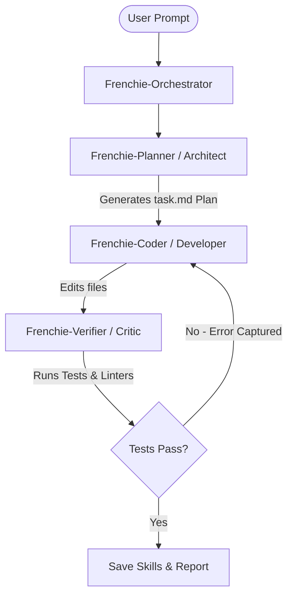

# 🐶 Frenchie (v0.1)

> **The Self-Evolving, Multi-Agent Autonomous Coding Assistant for your Terminal.**

---

<p align="center">
  
  
  
  
</p>

---

## 🌟 Introduction

**Frenchie** is a state-of-the-art terminal-based AI coding assistant designed to act as an autonomous software engineer directly inside your workspace. Unlike traditional chatbots or basic code completion tools, Frenchie operates as a **Multi-Agent system** with **deep context memory** and **self-healing execution loops**, allowing it to plan, write, test, and debug code with minimal user intervention.

Frenchie is built to compete with top-tier coding assistants like Claude Code and Hermes, but is engineered from the ground up to support **both local offline models (via LM Studio/Ollama)** and **cloud APIs (via Anthropic)**, switchable instantly in the middle of a session.

---

## 🚀 Key Innovation Highlights

### 🤖 1. Dynamic Multi-Agent Architecture
Frenchie doesn't just run a single prompt loop. It spawns specialized agents to solve complex coding tasks:

* **Frenchie-Orchestrator**: The central controller managing the conversational state, token usage, and sub-agent task assignment.
* **Frenchie-Planner (Architect)**: Scans the codebase, understands dependencies, and drafts a structured step-by-step technical plan (`task.md`).
* **Frenchie-Coder**: Implements the changes across multiple files using precise AST-aware edit tools.
* **Frenchie-Verifier (Critic)**: Automatically executes tests and linters, capturing log outputs. If a bug is found, it initiates a **Self-Healing Loop** prompting the Coder to auto-fix the issue before showing it to you.

### 🧠 2. Cognitive Memory System (CMS)
To keep the model oriented in large workspaces without blowing up your context budget, Frenchie utilizes a four-tier cognitive memory structure:
1. **Dynamic Project Map (`FRENCHIE_MAP.json`)**: An autogenerated, abstract blueprint of your project’s architecture, routing, database schemas, and module relations.
2. **Contextual Memory Anchors (`.frenchie/memory_anchors.json`)**: File-specific notes the agent saves about codebase quirks (e.g. "Note: this module requires UTF-8 output shims on Windows"). Whenever Frenchie reads that file, the anchor is automatically injected.
3. **Episodic Memory**: A sliding record of steps taken, tools run, and errors resolved during the session, giving the agent history-awareness.
4. **Working Scratchpad (`<scratchpad>`)**: An active workspace buffer where the sub-agents store raw compilation outputs, notes, and temporary variables.

### 🔬 3. Dynamic Runtime Execution Probe
Static analysis only goes so far. When debugging complex logical errors or parsing stack traces, Frenchie uses the **Runtime Probe (`ProbeExecution`)** tool:
* It spins up an isolated, temporary copy of your function.
* It wraps the execution in a tracer using `sys.settrace` to monitor variables.
* It outputs a **Runtime Snapshot** showing exactly which variables mutated, their dynamic types, and which code execution paths were taken.

### 🔄 4. Self-Evolution & Skill Learning
After successfully resolving a complex engineering problem, Frenchie reflects on the solution and saves a **"Skill Recipe"** inside `.frenchie/skills/`. When you ask a similar question in the future, Frenchie fetches the skill, bypassing expensive planning steps.

---

## 🛠️ Installation & Getting Started

### Prerequisites
- **Python 3.11** or higher
- **Git** (necessary for Git intent and blame tracking)

### Step-by-Step Setup

1. **Clone and Install**
   Clone the repository and install it locally in editable mode:
   ```bash
   git clone https://github.com/krysjak/frenchie.git
   cd frenchie
   pip install -e .
   ```

2. **Launch the REPL**
   Start the interactive, colorized terminal console inside any coding workspace:
   ```bash
   frenchie
   ```

3. **Run Single Queries**
   Execute quick tasks directly from your shell without launching the REPL:
   ```bash
   frenchie run "review the pyproject.toml file for dependency version mismatches"
   ```

---

## 🔌 Custom Providers & Local Setup

Frenchie supports local, open-weight models to keep your code private and run completely offline, or high-tier cloud APIs for complex logic.

### 💻 1. LM Studio (Local Offline)
1. Launch **LM Studio** and download a model (e.g., `qwen2.5-coder-7b-instruct` or `gemma-2-9b-it`).
2. Start the **Local Inference Server** (default port `1234`).
3. In the Frenchie REPL, switch your provider:
   - Run `/provider` -> select `lm-studio` (or `openai`).
   - Enter Base URL: `http://localhost:1234/v1`
   - Set the active model: `/model <your-model-name>`

### 🐋 2. Ollama Setup
1. Start Ollama locally.
2. Run `/provider` in Frenchie.
   - Enter Base URL: `http://localhost:11434/v1`
   - Enter Model: `qwen2.5-coder` or `llama3`

### ☁️ 3. Cloud APIs (Anthropic, OpenRouter, Groq)
* **Anthropic**: Run `/login` to save your `ANTHROPIC_API_KEY`, then select `anthropic` under `/provider`.
* **OpenRouter**: Set the base URL to `https://openrouter.ai/api/v1` and supply your OpenRouter token.

---

## 🎛️ Command Registry & REPL Shortcuts

Slash commands allow you to control the assistant live without interrupting the chat thread:

| Command | Arguments | Description |
|:---|:---|:---|
| `/provider` | `[openai / anthropic / lm-studio]` | Switch LLM host live |
| `/model` | `[model-name]` | Change active model |
| `/effort` | `[low / medium / high / xhigh]` | Set thinking token budget for supporting models |
| `/init` | — | Initialize `FRENCHIE.md` memory files in active project |
| `/permissions`| `[show / mode <plan, auto, default>]` | Configure safety approval modes for tool calls |
| `/mcp` | `[list / enable / disable]` | Manage Model Context Protocol (MCP) servers |
| `/memory` | `[list / edit]` | Inspect project map or memory anchors |
| `/doctor` | — | Verify installation settings, paths, and API keys |
| `/web` | — | Start the FastAPI visual dashboard |
| `/bridge` | — | Open the WebSocket editor integration bridge |

### Interactive Keybindings
* **`Tab`** (on an empty prompt): Toggle execution modes (`Build` ➔ `Plan` ➔ `Auto`).
* **`Ctrl + L`**: Clears the console and re-renders the bulldog header.
* **`Ctrl + D`**: Safely exit the REPL.
* **`Ctrl + C`**: Interrupt a streaming model response or kill a running subprocess tool.

---

## 📂 Architecture Overview

```
claude_code_py/
  ├── cli.py             # Click-based command-line interface entry points
  ├── repl.py            # prompt_toolkit REPL with status bar & auto-suggestions
  ├── query.py           # Core agent turn-loop, stream handler, and tool caller
  ├── permissions.py     # Approval policy manager (Plan, Auto, Build permissions)
  ├── config.py          # Environment and persistent JSON configuration models
  ├── commands/          # Subdirectory for REPL slash-commands (/provider, /mcp, etc.)
  ├── tools/             # Built-in actions (Read, Edit, Glob, Bash, Probe)
  ├── services/          # Services layer (Claude Client, cost tracking, bridge, dashboard)
  ├── mcp/               # Model Context Protocol host transport and resource tools
  └── resources/         # Markdown system prompts and guides
```

---

## 📄 License

Distributed under the MIT License. See `LICENSE` for more information.

